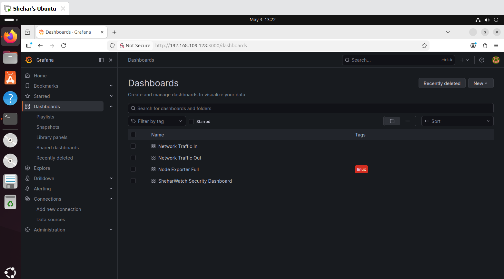
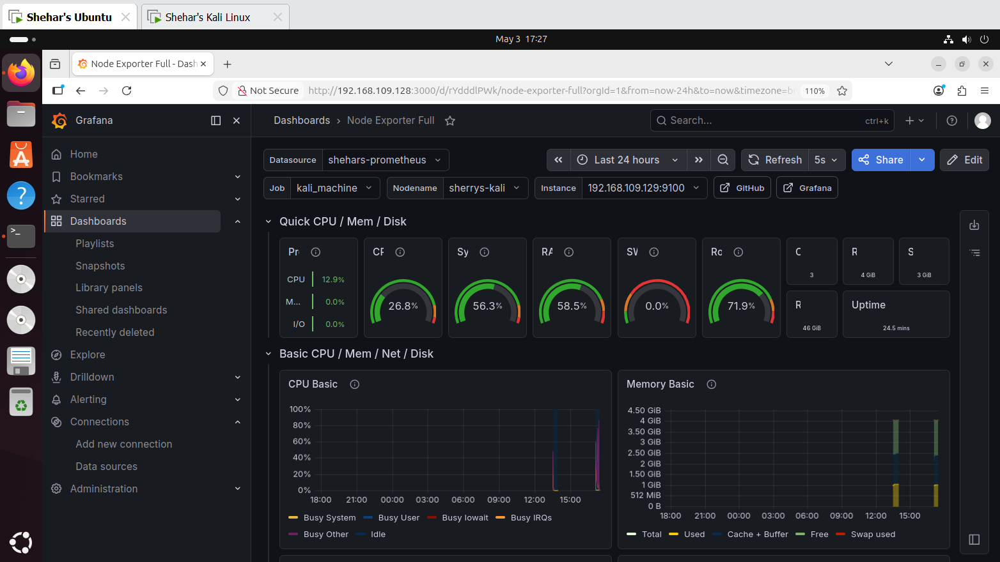
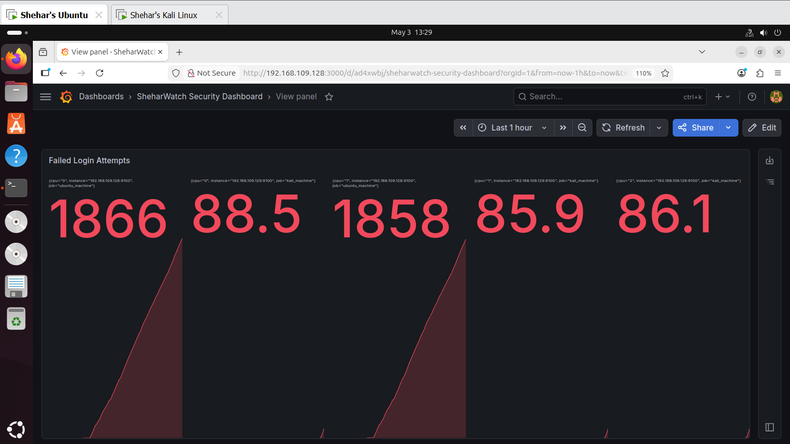
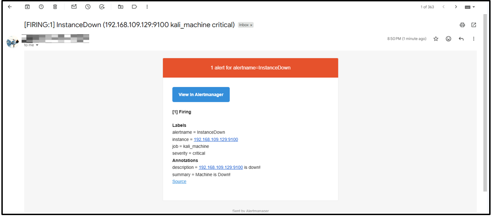
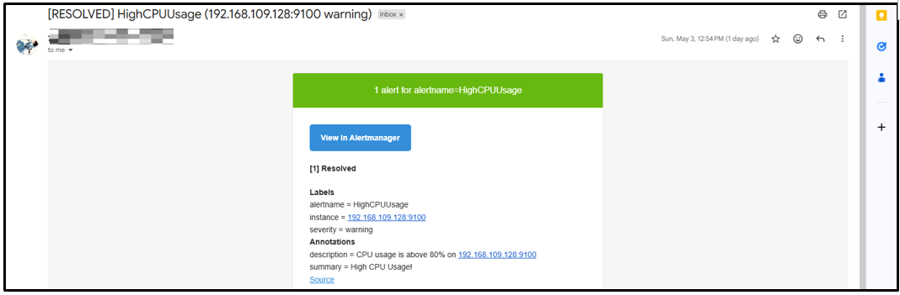
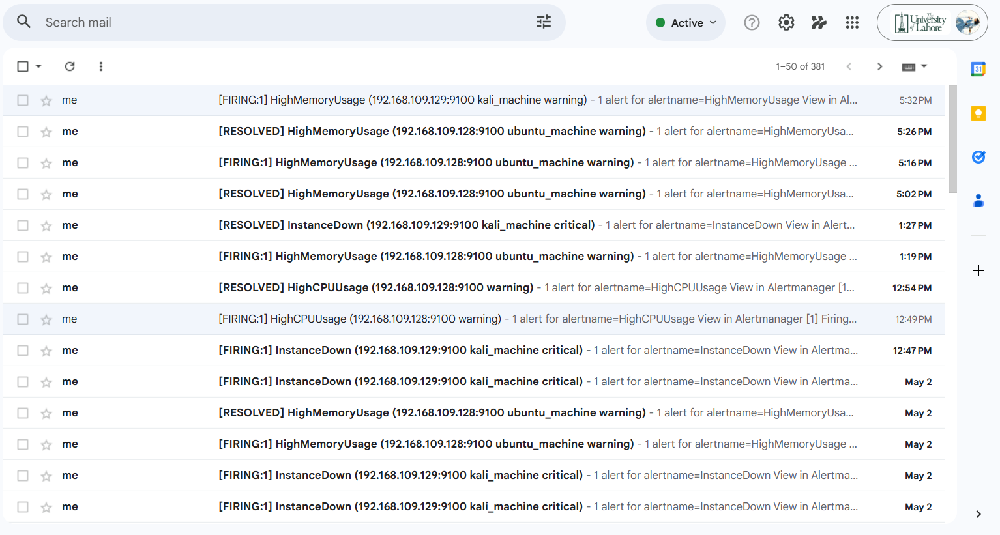
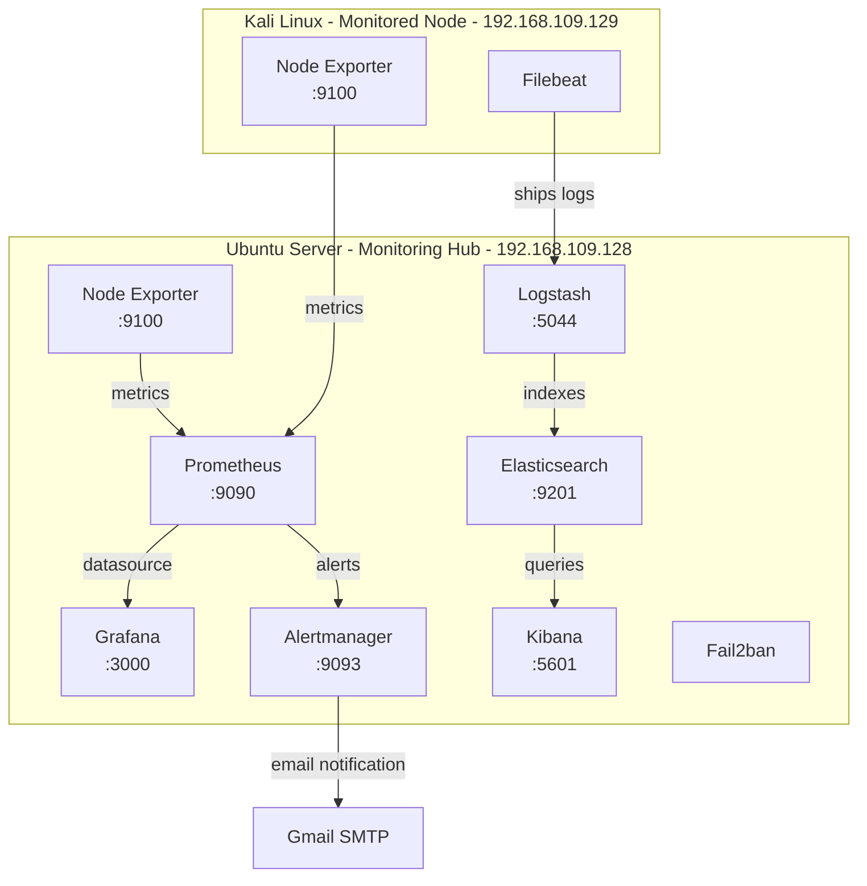

# 🛡️ Shehars-Network-Security-Monitoring-System

**A self-hosted observability & security monitoring stack that watches a multi-node network in real time** - built and validated on a two-VM Ubuntu/Kali Linux lab using Prometheus, Grafana, the ELK Stack, Alertmanager, and Fail2ban.

<p align="center">
  
  
  
  
  
</p>

> Built by **Shehar Bano** as a hands-on infrastructure monitoring & security project - mirroring the workflows used by real-world DevOps and SOC (Security Operations Center) teams.

---

## 📸 Screenshots

| Grafana - All Dashboards | Node Exporter Full - Live Stress Test |
|---|---|
|  |  |

| SheharWatch - Custom Security Dashboard | Alertmanager - Critical Alert Firing |
|---|---|
|  |  |

| Alert Resolved Notification | Full Alert History |
|---|---|
|  |  |

More screenshots and the full step-by-step walkthrough are in the [project report](docs/Network_Security_Monitoring_System_Report.pdf).

---

## 📑 Table of Contents

- [Overview](#-overview)
- [Architecture](#-architecture)
- [Tech Stack](#-tech-stack)
- [Key Features](#-key-features)
- [Repository Structure](#-repository-structure)
- [Getting Started](#-getting-started)
- [Alerting Rules](#-alerting-rules)
- [Dashboards](#-dashboards)
- [Security Monitoring](#-security-monitoring)
- [Stress Testing & Validation](#-stress-testing--validation)
- [Troubleshooting](#-troubleshooting)
- [Roadmap - Path to Production](#-roadmap--path-to-production)
- [Skills Demonstrated](#-skills-demonstrated)
- [License](#-license)
- [Author](#-author)

---

## 🔎 Overview

This project deploys a complete **observability and security monitoring pipeline** across a two-node virtualized network (Ubuntu Server + Kali Linux on VMware Workstation), simulating a realistic multi-host infrastructure.

It combines two complementary stacks:

- **Metrics & Alerting** - Prometheus scrapes system metrics from every node via Node Exporter, Grafana visualizes them on live dashboards, and Alertmanager fires email notifications the moment a threshold is breached.
- **Log Management** - Filebeat ships system and auth logs from Kali to Logstash, which parses and forwards them into Elasticsearch for full-text search and analysis through Kibana.

On top of that, **Fail2ban** and custom PromQL-driven Grafana panels add a lightweight security-monitoring layer capable of flagging suspicious login activity and abnormal network traffic - the same fundamental pattern used by SOC and DevOps teams in production environments.

The system was stress-tested under simulated CPU/memory load and instance downtime to validate that metrics, dashboards, and alerts all behave correctly end-to-end.

## 🏗️ Architecture



**Topology summary**

| Node | Role | IP Address | Services |
|---|---|---|---|
| Ubuntu Server | Monitoring Hub | `192.168.109.128` | Prometheus, Grafana, Alertmanager, Elasticsearch, Logstash, Kibana, Node Exporter, Fail2ban |
| Kali Linux | Monitored Node | `192.168.109.129` | Node Exporter, Filebeat |

## 🧰 Tech Stack

**Monitoring & Metrics**

| Tool | Version | Purpose |
|---|---|---|
| Prometheus | v2.45.0 | Time-series metrics collection & storage |
| Node Exporter | v1.6.0 | Hardware & OS metrics exporter agent |
| Alertmanager | v0.25.0 | Alert routing, grouping & notification dispatch |
| Grafana | Latest | Dashboards & visualization |

**Log Management (ELK)**

| Tool | Version | Purpose |
|---|---|---|
| Elasticsearch | v7.x | Full-text search engine & log storage |
| Logstash | v7.x | Log processing pipeline (input/filter/output) |
| Kibana | v7.x | Log visualization & analytics |
| Filebeat | v7.x | Lightweight log shipper (Kali → Logstash) |

**Security & Infrastructure**

| Tool | Purpose |
|---|---|
| Fail2ban | Intrusion prevention - bans IPs after repeated failed logins |
| stress | CPU/memory load generation for validation testing |
| VMware Workstation | Virtualization platform hosting both VMs |
| OpenJDK 11 | Java runtime required by Elasticsearch |

## ✨ Key Features

- **Real-time metrics pipeline** - Node Exporter → Prometheus → Grafana across every monitored host.
- **Centralized log pipeline** - Filebeat → Logstash → Elasticsearch → Kibana for searchable, structured logs.
- **Automated alerting** - Threshold-based PromQL alert rules for CPU, memory, disk, and instance downtime, routed through Alertmanager to email.
- **Custom security dashboard** - A purpose-built "ShehearWatch" Grafana dashboard tracking failed login attempts and network throughput per host.
- **Validated under load** - CPU and memory stress tests confirm dashboards and alerts respond correctly within minutes.
- **Production-aware design** - Every phase documents the next step needed to harden it for real deployment (TLS, RBAC, automation, containerization).

## 📁 Repository Structure

```
Shehars-Network-Security-Monitoring-System/
├── README.md                       # You are here
├── LICENSE                         # MIT License
├── .gitignore
├── docs/
│   └── Network_Security_Monitoring_System_Report.docx   # Full 9-phase build report
├── screenshots/                    # Dashboard, terminal & alert screenshots
├── configs/
│   ├── prometheus/
│   │   ├── prometheus.yml          # Scrape config + alerting block
│   │   └── alert_rules.yml         # CPU / Memory / Disk / InstanceDown rules
│   ├── alertmanager/
│   │   └── alertmanager.yml        # Email routing config (placeholders)
│   ├── logstash/
│   │   └── logstash.conf           # Beats input → grok filter → ES output
│   ├── filebeat/
│   │   └── filebeat.yml            # Log shipper config (Kali)
│   ├── elasticsearch/
│   │   └── elasticsearch.yml       # Network/port/security overrides
│   └── kibana/
│       └── kibana.yml              # Kibana server config
├── systemd/
│   ├── prometheus.service
│   ├── node_exporter.service
│   └── alertmanager.service
└── scripts/
    └── stress-test.sh              # CPU/memory load generator for validation
```

## 🚀 Getting Started

This repo ships the **exact configuration files** used in the lab build. The full, copy-pasteable, phase-by-phase install commands (including all `apt`, `wget`, `systemctl` steps) live in the [project report](docs/Network_Security_Monitoring_System_Report.docx) - this section is the condensed quick-start.

### Prerequisites

- 2+ Linux machines (tested on Ubuntu Server + Kali Linux) on the same network/VMware host-only network
- `sudo` access on every machine
- A Gmail account + [App Password](https://support.google.com/accounts/answer/185833) if you want email alerts

### 1. Install the metrics stack (on the hub machine)

```bash
# Prometheus, Node Exporter, Alertmanager, Grafana - see docs/ for full commands
sudo cp configs/prometheus/prometheus.yml      /etc/prometheus/prometheus.yml
sudo cp configs/prometheus/alert_rules.yml     /etc/prometheus/alert_rules.yml
sudo cp configs/alertmanager/alertmanager.yml  /etc/alertmanager/alertmanager.yml
sudo cp systemd/*.service /etc/systemd/system/
sudo systemctl daemon-reload
sudo systemctl enable --now prometheus alertmanager
```

> ⚠️ Edit `alertmanager.yml` first and replace the placeholder email/app-password with your own - **never commit real credentials**.

### 2. Install Node Exporter (on every monitored machine)

Repeat the Node Exporter install + `systemd/node_exporter.service` on each node you want to monitor, then add its IP under `scrape_configs` in `prometheus.yml`.

### 3. Set up Grafana

1. Add Prometheus as a data source (`http://<hub-ip>:9090`)
2. Import community dashboard ID **1860** (Node Exporter Full)
3. Build the custom security panels described in [Security Monitoring](#-security-monitoring)

### 4. Set up the ELK log pipeline (on the hub machine)

```bash
sudo cp configs/elasticsearch/elasticsearch.yml /etc/elasticsearch/elasticsearch.yml
sudo cp configs/kibana/kibana.yml               /etc/kibana/kibana.yml
sudo cp configs/logstash/logstash.conf          /etc/logstash/conf.d/logstash.conf
sudo systemctl enable --now elasticsearch kibana logstash
```

### 5. Ship logs from a monitored machine

```bash
sudo cp configs/filebeat/filebeat.yml /etc/filebeat/filebeat.yml
sudo systemctl enable --now filebeat
```

### 6. Validate everything

```bash
chmod +x scripts/stress-test.sh
./scripts/stress-test.sh all
```

Watch Grafana spike, then check Alertmanager (`http://<hub-ip>:9093`) and your inbox for the alert.

## 🚨 Alerting Rules

| Alert | Condition | Severity |
|---|---|---|
| `HighCPUUsage` | CPU > 80% for 2 minutes | warning |
| `HighMemoryUsage` | Memory usage > 80% for 2 minutes | warning |
| `DiskSpaceLow` | Disk usage > 85% for 2 minutes | critical |
| `InstanceDown` | Target unreachable (`up == 0`) for 1 minute | critical |

All four rules are defined in [`configs/prometheus/alert_rules.yml`](configs/prometheus/alert_rules.yml) and route through Alertmanager to email, with `[FIRING]` and `[RESOLVED]` notifications for full lifecycle visibility (see screenshots above).

## 📊 Dashboards

- **Node Exporter Full** (community dashboard #1860) - CPU, memory, disk I/O, network throughput, and uptime per host.
- **ShehearWatch Security Dashboard** - custom panels built on:
  - `rate(node_network_receive_bytes_total[5m])` - Network In
  - `rate(node_network_transmit_bytes_total[5m])` - Network Out
  - Failed login attempt tracking per instance

## 🔐 Security Monitoring

- **Fail2ban** is deployed on the monitoring hub to automatically ban IPs after repeated failed SSH login attempts.
- Custom Grafana panels surface network traffic anomalies in real time, using the security dashboard above.
- The log pipeline (Filebeat → Logstash → Elasticsearch → Kibana) centralizes `auth.log` and `syslog` from every node, enabling search and correlation across the network - a foundation for SIEM-style investigation.

## 🧪 Stress Testing & Validation

CPU and memory load were generated with the `stress` utility on both VMs to confirm the pipeline end-to-end:

- Grafana dashboards show CPU/memory spiking to 80–100% within seconds
- Alertmanager fires `HighCPUUsage` / `HighMemoryUsage` after the 2-minute threshold
- Alert state is visible live at `http://<hub-ip>:9090/alerts`
- Email notifications arrive for both the firing and resolved states

Run it yourself with [`scripts/stress-test.sh`](scripts/stress-test.sh).

## 🛠️ Troubleshooting

| Problem | Fix | Notes |
|---|---|---|
| Service won't start | `sudo journalctl -xe` | Check detailed error logs |
| Port not accessible | `sudo ufw allow <port>` | Open the required firewall port |
| Kali can't reach Ubuntu | Check VMware network adapter settings | Verify both VMs share a network |
| Elasticsearch won't start | Free at least 2GB RAM | Elasticsearch is memory-hungry |
| No data in Grafana | Wait 2–3 minutes after setup | Prometheus needs time to collect initial data |
| Filebeat not shipping logs | Check Logstash port 5044 | Verify Logstash is accepting connections |

## 🗺️ Roadmap - Path to Production

This is a working prototype. Maturing it toward an enterprise-grade deployment would follow three stages:

**Near-term**
- TLS/HTTPS on all dashboards and APIs
- Replace default Grafana credentials + enable RBAC
- Scale to additional nodes via simple `prometheus.yml` edits

**3–6 months**
- Automate deployment with Ansible playbooks
- Move from static targets to Prometheus service discovery
- Containerize the full stack with Docker Compose

**6–12 months**
- Kubernetes deployment via the `kube-prometheus-stack` Helm chart
- Cloud monitoring (AWS/Azure/GCP exporters)
- Upgrade ELK to a full SIEM with threat-intel feed integration (MISP, OpenCTI)
- High availability with Thanos/Cortex + clustered Elasticsearch

## 🎓 Skills Demonstrated

- Linux service management with `systemd` (unit files, `journalctl`, enable/start/status)
- Writing PromQL queries for alerting and dashboarding
- Building and importing Grafana dashboards, including custom panels
- Centralized log aggregation and parsing with `grok` filters in Logstash
- Configuring intrusion prevention (Fail2ban) and SIEM-adjacent log analysis
- Static IP networking, firewall rules, and service discovery in a virtualized lab
- End-to-end validation methodology (load testing → observe → alert → confirm)

## 📄 License

This project is licensed under the [MIT License](LICENSE) - feel free to fork, adapt, and build on it.

## 👤 Author

**Shehar Bano**
Project Type: Infrastructure Monitoring & Security · Academic / Portfolio Project · 2026

If this project helped you learn something, consider ⭐ starring the repo.